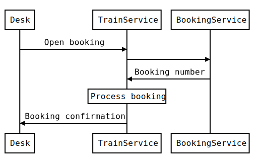

# Sequence Diagram



```
Desk->TrainService: Open booking
TrainService->BookingService: 
BookingService->TrainService: Booking number
Note over TrainService: Process booking
TrainService->Desk: Booking confirmation
```

_Made with [js-sequence-diagrams](https://bramp.github.io/js-sequence-diagrams/)_
